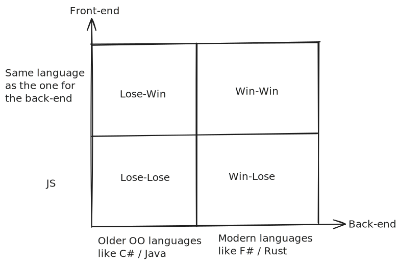

# Strategy

You must have seen the *Win-Lose* matrix - in my experience, in the context of programming languages, the matrix looks like this -

## Worst case scenario

You must be thinking, why do older OO languages (like C# or Java) represent a **losing strategy** (*bottom-left corner*)? Well, because the cons outweigh (**>**) the pros -

| Pros | Cons |
|------|------|
| Huge talent pool (of developers) | |
| A lot of resources (books, documentation, SO answers etc.) | |
| | Wrong defaults (Reference Equality, no REPL etc.) |
| | Nulls (or the dreaded NPEs) |
| | Even if new features are added, the older weaknesses don't go away, completely |

### JavaScript

JS needs a special mention here - there is no doubt that JS is one of the most widely used languages, and its **undeniable advantage is reach**, but [TypeScript](https://www.typescriptlang.org/) exists only because of JS's limitations, *so you should look for a better alternative then the whole JS / TS combination*.

## Taking the middle path

Now, you may be thinking if the older OO languages represented a losing strategy, then how come they can also represent a **winning strategy** (*top-left corner*)? Well, that's because of the magic of [WebAssembly](https://webassembly.org/) abbreviated as *Wasm*. Both, C# through [Blazor](https://dotnet.microsoft.com/en-us/apps/aspnet/web-apps/blazor) and Java through [CheerpJ](https://cheerpj.com/) (and consequently, the applications written in these languages), gain the ability to run in browsers, *thanks to Wasm* - thereby giving these languages the **same reach** as JS.

## Best case scenario

So why do modern languages represent a **winning strategy** (*both the bottom-right and top-right corners*)? Well, obviously because they learnt from the mistakes of previous languages and eliminated a lot of pitfalls, like nullifying NPEs 😜 (because of their use of Option & Result / Either datatypes), or adopting the correct defaults (like Value Equality), and by giving us REPLs (Read-Eval-Print-Loops) or the Interactive Mode.

## Busting myths

So now, it's time to bust a few [myths](./myths.md), let's go.
